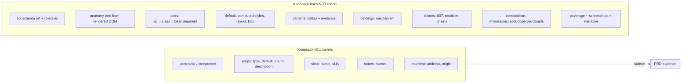

# kickstartDS Component Contracts PRD vs. Knapsack Design System Contract

> **Last updated:** 2026-09-26
>
> Compares [kickstartds-component-contracts-prd.md](../prd/kickstartds-component-contracts-prd.md)
> (internal PRD, 2026-08-03) against the published open format
> [`knapsack-oss/design-system-contract`](https://github.com/knapsack-oss/design-system-contract)
> (format v0.1, spec v0.11.0, 2026-09-24).
>
> **Sources:**
> - PRD: `docs/internal/prd/kickstartds-component-contracts-prd.md`
> - Repo: https://github.com/knapsack-oss/design-system-contract
>   (`spec/spec.md`, `spec/constitution.md`, `schemas/*.json`, `examples/*`, `test/schemas.test.mjs`, `README.md`, `docs/future-directions.md`, `NOTICE`)

---

## Verdict

Not rivals — a **specification with a schema** vs. an **unbuilt PRD for a much larger format**. Knapsack's Design System Contract is a published, Apache-2.0, v0.1 open format covering the *API half* of a component (props/slots/states + identity + integrity manifest). The kickstartDS PRD proposes a superset that adds the *styling half* (anatomy, token joins, visual deltas, bindings, evidence, coverage) — precisely the half it argues exists nowhere. Knapsack cannot replace the PRD build; it can displace roughly 10–15% of the PRD's format surface (identity, prop declaration, slots naming, catalog/manifest, DSDS interop) and, notably, the PRD **predates** the Knapsack v0.1 release, so it never evaluated it.

---

## 1. What each artifact actually is

| | kickstartDS PRD | knapsack-oss/design-system-contract |
|---|---|---|
| Genre | Internal PRD, "📐 Proposal — awaiting decision" | Published open spec + schemas + tests |
| Maturity | Pre-build; no code; Appendix B is a *seed* schema | v0.1 shipped; 2 schemas, 1 example, 1 test file |
| Version marker | `kickstartds/component-contract@1` (planned) | format v0.1; spec doc v0.11.0 |
| Date | 2026-08-03 | spec last-amended 2026-09-24 (~7 weeks later) |
| License | Unstated (internal) | Apache-2.0 + NOTICE prior-art list |
| Author | kickstartDS Design System / Platform | `knapsack-oss` (Knapsack — vendor, "open spec, commercial implementation") |
| Signals | 1382 lines, plan/risks/metrics/phases | 3 stars, 0 forks, 1 issue; no tooling shipped |
| Consumer target | kickstartDS's own MCP servers, Storyblok, website | Any tool/agent; DSDS as the documented integration |

**Crucial framing:** the PRD is a *plan to derive* a format; the repo *is* a format. The right comparison is "does the published format change the PRD's build/compose calculus", not "which format wins".

---

## 2. Shared premise (they agree on the diagnosis)

Both open identically: agents weight nearby code over rules they can't read, so they invent props, variants, and lookalike components. Both cite Nathan Curtis; both pick the same organizing triad (anatomy/default/variants — PRD §1.3, repo README/DSDS mapping); both want one JSON file per component, machine-validated, agent-facing.

Independently convergent micro-decisions (evidence the core shape is right):

- **No separate `variants` block in the API model.** PRD leaves prop-level classification to `axes` (PRD §5.5); repo rules it explicitly (D-73: "a second enumeration is a second source of truth").
- **Model output must not be load-bearing.** PRD quarantines narrative in a separate file (PRD §5.12); repo's PROH-2 bans any model inference in a mechanical check.
- **Schema is ground truth, prose is a projection.** PRD (Curtis #4, generated `brief`) vs repo PROH-5 (schema outranks prose).
- **Determinism is a first-class property.** PRD §6.4 byte-identical regeneration; repo SR-142/SR-143 + INV-1.

---

## 3. Scope coverage — where they overlap

| Dimension | PRD | Knapsack v0.1 |
|---|---|---|
| Identity | `id` (`^[a-z0-9-]+$`) + `title` | `contractId` (strict fold) + `component` (display verbatim) |
| Prop API | references dereffed schema; adds `role` + `axis` | **inline JSON Schema 2020-12** (`properties`/`required`/`additionalProperties`) |
| Prop type richness | full JSON Schema (anyOf, items, …) via reference | capped to `type`/`default`/`description`/`enum` (D-71 cost) |
| Variant axes | `axes` with 3-vocabulary join + `issues` | enum-typed prop; values ordered default-first (DSDS mapping) |
| Default baseline | declared `{Name}Defaults.ts` + synthetic story + resolved styles | prop `default` only |
| Slots | `composition.slots` (min/max/accepts/itemShape/observedCounts) | `slots` (bare name or `{name,description,a11y}`) |
| States | **deferred** (not statically observable, §9) | `states: string[]` (names only) |
| Tokens | central: catalog, `tokenSegment`, `resolves`, token-graph | **out of v0.1**, deferred; DTCG byte-verbatim on arrival (PROH-3) |
| Anatomy | first-class DOM-observed tree | absent |
| Visual evidence | computed styles, box, screenshots, story ids | absent |
| Bindings (prop→visual mechanism) | first-class enum | absent |
| Coverage/self-audit | `coverage` scores + backlog | none; known-limitations list instead |
| Manifest/integrity | `index.json` + per-contract input hashes | `manifest.json` + `sha256` content address (RFC 8785) + `origin` |
| Prose | vision-model narrative, quarantined | none (judgment layer deferred) |
| DSDS interop | cited as related doc only | **normative** `specs[]` pointer + trait mapping |

---

## 4. Deep divergences

### 4.1 Derived vs. authored — the fundamental split

PRD principle 8: "Nothing in a contract may be hand-written"; 0 hand-authored bytes is a success metric; contracts are gitignored source, published from `dist/contracts/`. Knapsack inverts this: a **publisher** writes contracts, `origin ∈ {inferred, synced}` records provenance, `authored` is deferred (D-78), and *extraction is deliberately out of scope* (D-72 for slots/states, D-70 for tooling, Appendix A derivation profiles are a stub "left to the publisher").

kickstartDS contracts, in Knapsack's vocabulary, would be `synced` (from the DS's own source of truth). Mechanically compatible, philosophically opposite: PRD builds the generator Knapsack declines to specify.

### 4.2 Identity and the fold

Knapsack has a rigorous 5-step fold with two rejection classes and collision-as-hard-failure (SCN-014/015, SR-130–133), aligned to the DSDS `id` pattern. PRD's `id` pattern is looser and would accept `button--primary` and `-button`, both of which Knapsack rejects; PRD has no fold and no collision handling. For kickstartDS's stability requirement, Knapsack's fold is strictly better *and free*.

Caveat: Knapsack's own known-limitations admit "the `contractId` fold has no executable test".

### 4.3 `disabled`: prop or state?

Knapsack lists `disabled` as both a boolean prop and a state, and its own README flags this as an uncovered DSDS mapping case. PRD resolves it precisely: a boolean axis with `mechanism: attribute`, producing `.c-button--disabled` (PRD §5.5, §5.8). PRD's model is more discriminating here.

### 4.4 Prop declaration: inline schema vs. reference

Repo: `props` *is* a valid JSON Schema you can compile and validate a prop bag against (test: `props is itself a usable JSON Schema 2020-12 schema`).

PRD: `api.props` is a bespoke object (`type: "enum"`, `values`, `role`, `axis`) that references `./button.schema.dereffed.json`. It is not itself validatable and duplicates a slice of the schema in a non-standard dialect.

Knapsack's inline-schema approach is more portable; PRD's reference approach better honors "normalized over redundant" (Curtis #2) but yields a non-standalone artifact.

### 4.5 Integrity

PRD's `generated.inputs` hashes prove *derivation reproducibility*. Knapsack's `address` (SHA-256 over RFC 8785 canonical form) proves *published-artifact integrity*, and a mismatch invalidates the artifact (SR-137, INV-5). Complementary, not competing — the PRD has no equivalent for the published bytes.

### 4.6 Model prose

Both exclude it from the mechanical artifact, but by different mechanisms: PRD *quarantines* it (`{name}.narrative.json`, no lint rule/tool may depend on it) while still shipping it; Knapsack *bans* it from checks (PROH-2) and defers any judgment layer entirely. If kickstartDS adopted Knapsack's constitution, Pass 4 would remain legal only because it is quarantined — which it already is.

---

## 5. Principles / governance

| | PRD | Knapsack |
|---|---|---|
| Principle source | Curtis' 7 + own #8 (derived) | constitution v5.0.0: PROH-1..5 + 8 preferences |
| Openness | not stated | Apache-2.0, PROH-1 (never proprietary), NOTICE prior art |
| Determinism | §6.4, byte-identical; Pass 4 excluded | PROH-2, SR-142/143, INV-1 |
| Composition | references existing artifacts; rejects Specs shape | PROH-4: must check DSDS/CEM/shadcn/DTCG/`ds-contracts-poc` before inventing a field |
| Change control | `$format` pin + ADRs (`docs/adr/`) | CC-1..6 require maintainer decision; decision log D-70..D-81; schema changes recorded *before* landing |
| Platform stance | deliberately DOM/web-biased (principle 3) | vendor-neutral, JS/web-flavored (CEM/shadcn) but no DOM model |
| Test posture | Phase 5 A/B on agents; lint rules; coverage | committed Ajv + RFC 8785 tests for shape only |

Governance gap is the biggest non-technical difference: Knapsack is built to be implemented by strangers (prohibitions, prior-art checks, recorded decisions); the PRD is a single-owner internal artifact with no ratification path.

---

## 6. Can kickstartDS adopt Knapsack's format? (mostly no — and why)

Adopting it **as the contract format** would fail the PRD's own motivating test. The PRD's headline defects — `--dsa-button_terciary--*` vs `tertiary`, `share-bar`/`sharebar`, prop→visual causality, `questions[].question → root/item/summary/text → --dsa-faq__summary--*` — live entirely in anatomy/tokens/axes/bindings, none of which Knapsack models. Knapsack's `props`/`slots`/`states` correspond to PRD §1.1's "API half", which kickstartDS *already* publishes (schema + Storybook). So Knapsack solves a different problem: portable, validator-friendly API contracts + integrity addressing + DSDS interop.

**What it can displace cheaply:**

- Identity: adopt the `contractId`/`component` split and the 5-step fold + collision rule verbatim; align `id` to the DSDS pattern.
- Manifest: adopt `sha256` content addressing and the `inferred|synced` origin for `dist/contracts/`.
- Prop declaration: project `api.props` (which already classifies `axis`/`role`) into a Knapsack-valid `props` object — enum→axis is exactly the mapping it wants, so the projection is mechanical (same play as the PRD's kept Specs spike, §10.3).
- DSDS: add the `specs[]` pointer + trait mapping; near-free, and PRD Appendix C already cites DSDS without integrating.
- Naming discipline: Knapsack's PROH-4 prior-art check is a stronger version of PRD §1.3 "reuse existing patterns".

**What it cannot carry:** anatomy, axes join, variants/deltas, bindings, tokens/resolves, composition cardinality, coverage, screenshots, narrative. Extending Knapsack to hold these would violate PROH-4 (novel field without prior-art analog → CC-5 maintainer decision) — i.e. it would be a **fork**, not adoption.

---

## 7. Strategic notes

- **Timeline matters.** PRD dated 2026-08-03; Knapsack v0.1 resolved 2026-09-24. The PRD *could not* have evaluated it. This comparison is net-new information for that decision.
- **Two formats, one problem.** If kickstartDS ever publishes its format (the PRD implies `dist/contracts/` only, so probably not), it would sit adjacent to an existing Apache-2.0 format addressing the same audience — inviting the "compose, don't fork" critique Knapsack's constitution formalizes.
- **Shared lineage.** Both compose with DSDS; both draw on Southleft priors (PRD evaluated Specs by Southleft; Knapsack's NOTICE cites Southleft's `ds-contracts-poc`). Same family, different branches. [INFERENCE on the Specs↔Southleft link; the PRD links `specsplugin.com` and the repo's NOTICE names `ds-contracts-poc`.]
- **Complementary, not substitutable.** Knapsack's "Future directions" list (tokens, cross-prop rules, deterministic checker, provenance) is a subset of what the PRD plans *now*; the PRD's list is strictly larger except for licensing/governance.

---

## 8. Doc-level inaccuracies worth flagging

**PRD (numeric inconsistency across sections):** §1.1 cites 157 screenshots; §6.1/§5.12 imply 137 authored stories + 77 generated defaults = 214 observations/vision calls; §6.6 says "~50ms × **234**". 234 and 157 are both unexplained. §1.1 also lists `storybook-static/index.json` = 211 entries vs 137 snippets. Low severity, but the PRD's whole argument rests on these counts.

**Knapsack repo (self-declared known limitations):** publish-time checks (required∉properties, default∉enum, collisions) exist in prose only — no tool runs them; the fold has no executable test; `"enum": []` accepted; prop names unconstrained; `contractVersion` free text; `slots[].a11y.required` undefined; DSDS trait mapping has uncovered cases (`disabled` as prop+state, boolean+enum, `type: [boolean]`) and was hand-checked against DSDS 0.21.1 with nothing re-checking it.

---

## 9. Recommendation

Treat the Knapsack format as a **composition target for the API/identity/integrity layer**, not as a replacement:

1. Add it to PRD §10 as a second evaluation (it did not exist at authoring time) — alongside Specs — with the finding: *subset of our intent, superset of our portability/governance*.
2. **Adopt verbatim** where they're orthogonal and already standards-aligned: the fold + collision rule, the `contractId`/`component` split, manifest content addressing, DSDS `specs`/trait mapping.
3. **Emit a Knapsack-compatible projection** from each kickstartDS contract (`api` + `composition.slots` + deferred `states`) as a derived output, mirroring the kept Specs spike. Cheap, because `axes`/enum classification already exists.
4. **Do not** try to express anatomy/tokens/bindings/variants in Knapsack's schema — that's the PRD's exclusive value and would require forking its constitution.

That yields DSDS interop, integrity verification, and a portable API contract for free, while the PRD keeps owning the three-vocabulary join it was written to deliver.
